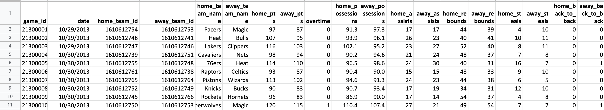
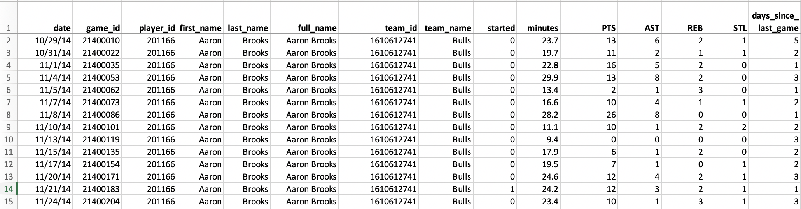

# nba_winning_prediction
#### by Yilin Chen, Xuechun Dou, Meixiao Han, Chun He, Qinchen Sun

The goal of this project is to predict the winner of a given NBA match using historic data. We will take 2 approaches to solving this problem:
  1. On a team level; 2. On individual players level

### Data

**Team Data**

Team data contains 4,170 entries and 19 variables of each games played in the NBA of 3 seasons from 2013 - 2016.

**Player Data**

Player data contains 82,895 entries and 15 variables of the performance of each player for each games they played from 2013-2016.

### Approach 1

### Approach 2 
The problem with the last approach is that it fails to take into consideration the essentials in basketball games - players. In NBA games, players changes teams frequently and the team's strength is heavily reliant on who is playing in that season. Therefore, to account for the changes in rosters, we are constructing individual player scores and using player-adjusted scores to reflect a team's rating.

Through literature research, we were able to find a commonly used way to quantify player's performance. After adjusting by minutes played and data available, we calculated player scores as the following: 

__Performance_Score per game__ = ((**Points**)+(**Rebounds**)+(**Steals**)+(1/2 * **Assists**))/ **Minutes played**
__Performance_Score per season__ = average (**Performance_Score per game**) in one season
__Team_rating__ =  average **rating of each player** in this team in the past season

(Note: this limit of this approach is that it does not give credit to the growth of a player. We simply take the performance of a player in the past season as the predictor for performance in this season. )

